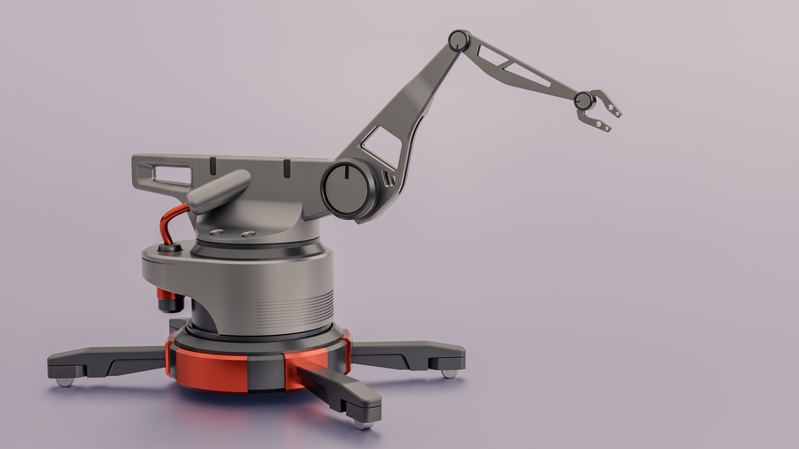

# Coursework for "Hard Surface Modeling Jumpstart"

This contains the projects used for the course [Hard Surface Modeling Jumpstart](https://www.blenderbros.com/products/hard-surface-modeling-jumpstart).

<table width="100%">
<tbody>
<tr>
<td>
<figure>
<figcaption>Final Render</figcaption>

</figure>
</td>
</tr>
</tbody>
</table>
